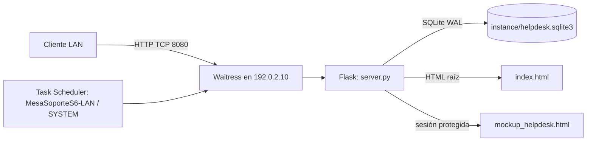

# Documentación técnica del sistema

**Mesa de Soporte S6 — estado implementado al 8 de octubre de 2026**

Esta página describe el software que realmente ejecuta el proyecto. Los procedimientos detallados están separados para que usuarios, operadores y migradores tengan instrucciones apropiadas:

- [Índice de documentación](docs/INDICE_DOCUMENTACION.md)
- [Manual de usuarios](docs/MANUAL_USUARIOS.md)
- [Manual de administrador TI](docs/MANUAL_ADMIN_TI.md)
- [Migración a otra unidad/servidor](docs/MIGRACION_ENTRE_UNIDADES.md)
- [README e instalación](README.md)
- [Changelog](CHANGELOG.md)

## Estado actual

El runtime es Flask y Waitress con SQLite central para tickets, sesiones administrativas y bitácora. En el host piloto corre mediante la tarea programada `MesaSoporteS6-LAN` bajo SYSTEM.

- Portal cliente: `http://192.0.2.10:8080/` (sirve el `index.html` personalizado).
- Consola administrativa: `http://192.0.2.10:8080/login`.
- Listener: `192.0.2.10:8080`; no es un listener comodín.
- Firewall: entrada TCP 8080 desde `192.0.2.0/24`, perfil Domain.
- Base: `D:\HELP DESK TELEMATICA\instance\helpdesk.sqlite3`.
- Secreto de sesión: `C:\ProgramData\MesaSoporteS6\lan-session-secret.txt`, ACL para SYSTEM/Administradores.

> **Riesgo del piloto:** HTTP no cifra tickets, credenciales ni cookies de sesión. El ámbito del firewall reduce el alcance, pero no sustituye TLS. No exponga este modo a Internet, Wi-Fi público ni otras sedes/subredes. Para acceso interunidad, publique HTTPS institucional según [Migración entre unidades](docs/MIGRACION_ENTRE_UNIDADES.md).

## Arquitectura



La consola consulta y modifica tickets mediante `/api/tickets`; no persiste tickets en el navegador. El sitio estático no proporciona una API ni comparte una SQLite: no despliegue el directorio como un recurso SMB o como un sitio estático.

## Componentes

| Ruta | Función actual |
|---|---|
| `server.py` | Fábrica Flask, seguridad, API, esquema SQLite, alta del primer administrador y modos de ejecución. |
| `index.html` | Formulario de cliente que se muestra en `/` y crea tickets en el API. |
| `mockup_helpdesk.html` | Consola técnica servida únicamente por la ruta autenticada `/admin`. |
| `templates/login.html` | Inicio de sesión con CSRF. |
| `templates/index.html` | Plantilla anterior de demostración; no se usa en runtime y no debe publicarse (incluye recursos externos/simulación). |
| `web.config` | Proxy/redirección HTTPS para un futuro IIS con URL Rewrite/ARR y TLS; el piloto Waitress directo no lo usa. |
| `deploy/run-lan-http.ps1` | Configura y ejecuta el modo HTTP LAN en la IP asignada. |
| `deploy/install-lan-task.ps1` | Registra la tarea de arranque SYSTEM y protege ACL de la base. |
| `requirements.txt` | Flask y Waitress. |
| `tests/test_server.py` | Pruebas de autenticación, API, límites, consola, portal raíz y guard de enlace LAN. |
| `database_schema.sql` | Esquema relacional legado de referencia; no se ejecuta al iniciar el servidor. |
| `datos/` | Inventario de referencia y datos consolidados; no forman parte de la SQLite transaccional de tickets. |

## Flujos y endpoints

- `GET /`: sirve el formulario `index.html` actual.
- `GET /docs/<manual-html>`: sirve solo los cuatro manuales HTML incluidos en la allowlist; no permite navegar el directorio del proyecto.
- `GET /login`: formulario de autenticación.
- `POST /api/login` y `POST /api/logout`: autenticación con cookie de sesión y token CSRF.
- `GET /api/session`: requiere sesión autorizada; devuelve identidad y CSRF.
- `POST /api/tickets`: entrada pública limitada por IP; genera radicado `S6-AAAA-NNNNNN` y evento inicial.
- `GET /api/tickets`: listado solo para usuarios autenticados con rol `admin` o `technician`.
- `PATCH /api/tickets/<id>`: cambios de estado/asignación y notas, con sesión y CSRF.
- `GET /admin`: sirve la consola solo después de validar la sesión.

La entrada valida campos obligatorios, límites de longitud y correo terminado en `@example.org`. Se permiten 10 envíos por dirección IP durante 10 minutos. Si el servicio está tras un proxy, no active `HELPDESK_TRUSTED_PROXY=1` a menos que el proxy reemplace encabezados `X-Forwarded-For` entrantes.

## Base de datos

El runtime inicializa cuatro tablas: `users`, `tickets`, `ticket_events` e `intake_limits`, más índices. SQLite usa claves foráneas y WAL. La identidad de radicado se genera en el servidor; los estados aceptados son `Abierto`, `En Proceso`, `En Espera`, `Resuelto` y `Cancelado`.

La base por defecto está en `instance/helpdesk.sqlite3`; `HELPDESK_DATA_DIR` permite indicar otra carpeta. En el piloto, la tarea ejecuta como SYSTEM y el instalador restringe la carpeta a SYSTEM/Administradores. No sincronice una copia de SQLite mientras el servicio escribe: detenga la tarea o use la API de backup SQLite.

El primer administrador se crea de forma interactiva con `python server.py create-admin`. No hay cuenta predeterminada. Los hashes usan PBKDF2-HMAC-SHA256 con salt. El secreto de Flask es externo al código y debe ser persistente; el modo LAN lo conserva en `C:\ProgramData`.

## Seguridad

- Cookies HttpOnly y SameSite Strict; CSRF en escrituras autenticadas; consultas parametrizadas.
- La consola y el listado de tickets requieren sesión. El input del ticket se escapa al renderizar la consola.
- Las notificaciones de creación y cambio de estado se envían desde el backend al correo institucional registrado por el solicitante mediante un relay SMTP configurado por variables de entorno. Las credenciales no se guardan en el navegador ni en la base de datos.
- Los tokens y contraseñas no deben guardarse en `localStorage`, documentos, código, tarea programada ni tickets.
- HTTP en LAN solo es un piloto temporal. El cifrado, certificado y controles de TLS dependen de la PKI institucional y el binding IIS/ARR.
- La regla LAN debe enumerar solo los CIDR autorizados. No abra el puerto 8080 a `Any` ni configure `HELPDESK_HOST=0.0.0.0`.

## Persistencia y mantenimiento

La tarea `MesaSoporteS6-LAN` inicia a los 30 segundos del arranque, corre bajo SYSTEM, ignora instancias duplicadas, no tiene límite de ejecución y reintenta hasta cinco veces cada minuto. Ver estado con:

```powershell
Get-ScheduledTask -TaskName MesaSoporteS6-LAN
Get-ScheduledTaskInfo -TaskName MesaSoporteS6-LAN
Get-NetTCPConnection -State Listen -LocalPort 8080
```

Reinicio: `Restart-ScheduledTask -TaskName MesaSoporteS6-LAN`. El manual TI incluye backup, recuperación y diagnóstico.

## Límites conocidos y trabajo futuro

- Inventario, usuarios/agentes, directorio y ciertos ajustes siguen en `localStorage` de la consola; no son centrales ni multiusuario.
- Los formularios aceptan imágenes JPEG, PNG y WebP. El navegador las comprime antes del envío; el backend valida tamaño y tipo, y las almacena ligadas al ticket para la consulta administrativa autenticada.
- No hay historial de estado autoservicio para el solicitante, gestión de cuentas dentro de la consola, reset de contraseñas, SLA calculado en backend ni correo de confirmación.
- La consola aún muestra módulos históricos de inventario/configuración que no representan servicios centrales.
- Para producción multiunidad: HTTPS con CA institucional, IIS/ARR o proxy aprobado, firewall por CIDR, servicio operativo bajo cuenta administrada, política de backup/retención, revisión de permisos y pruebas de recuperación.

## Validación

Desde la raíz del proyecto:

```powershell
.\.venv\Scripts\python.exe -m unittest discover -s tests
```